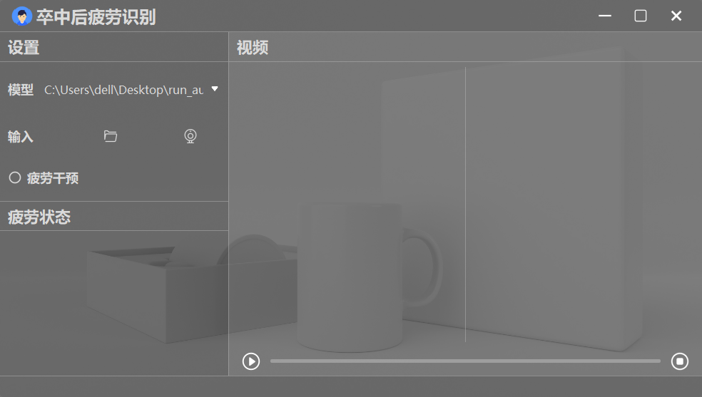

# 基于三维卷积神经网络的卒中患者疲劳检测
本项目构建基于迁移学习的C3D模型用于卒中后疲劳识别；针对数据集的类别不平衡特点，构建基于重采样的C3D网络模型；在上述基础上，提出基于Bagging集成学习的卒中后疲劳识别算法；基于上述算法实现，利用PyQt5设计了一款实时运行、用户友好的卒中后疲劳识别系统，该系统界面如下：

## 运行环境
详见[requirements.txt](requirements.txt)
## 预训练权重文件
预训练权重文件下载：[GoogleDrive](https://drive.google.com/file/d/1mdx4nfkFODHV8RXV8489CWlTY5yx1FK8/view?usp=drive_link)
## 代码运行
### 1 - 运行[generation_process.py](train/generation_process.py)
数据预处理
### 2 - 运行[train.py](train/train.py)
模型训练
### 3 - （可选）运行[inference.py](train/inference.py)
模型测试
### 4 - 运行[main.py](main.py)
卒中后疲劳识别系统入口
## 主要文件说明
+ [generation_process.py](train/generation_process.py)：数据预处理
+ [mypath.py](train/mypath.py)：原始数据集、预处理后数据集、预训练文件路径配置
+ [utils.py](train/utils.py)：工具类或函数
+ [train.py](train/train.py)：模型训练
+ [inference.py](train/inference.py)：模型测试
+ [base_process.py](train/base_process.py)：日志处理类
+ 
## 参考代码
+ [C3D模型](https://github.com/jfzhang95/pytorch-video-recognition.git)
+ [UI界面](https://github.com/Javacr/PyQt5-YOLOv5.git)
